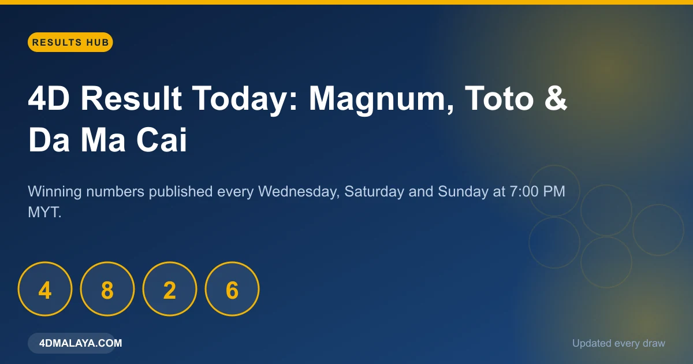
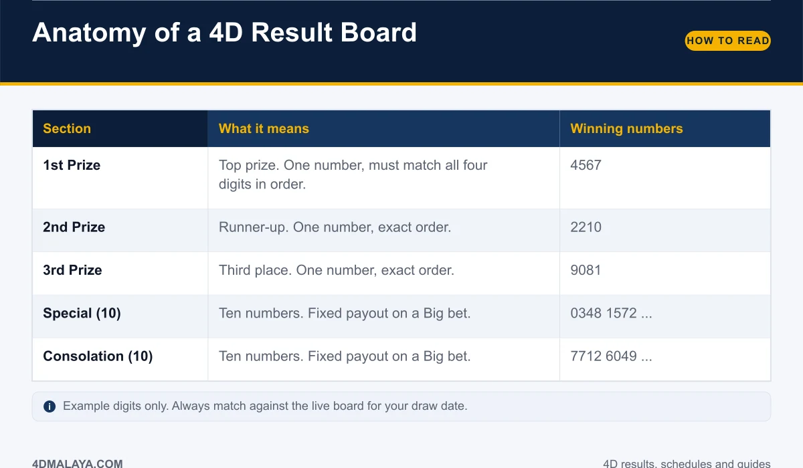
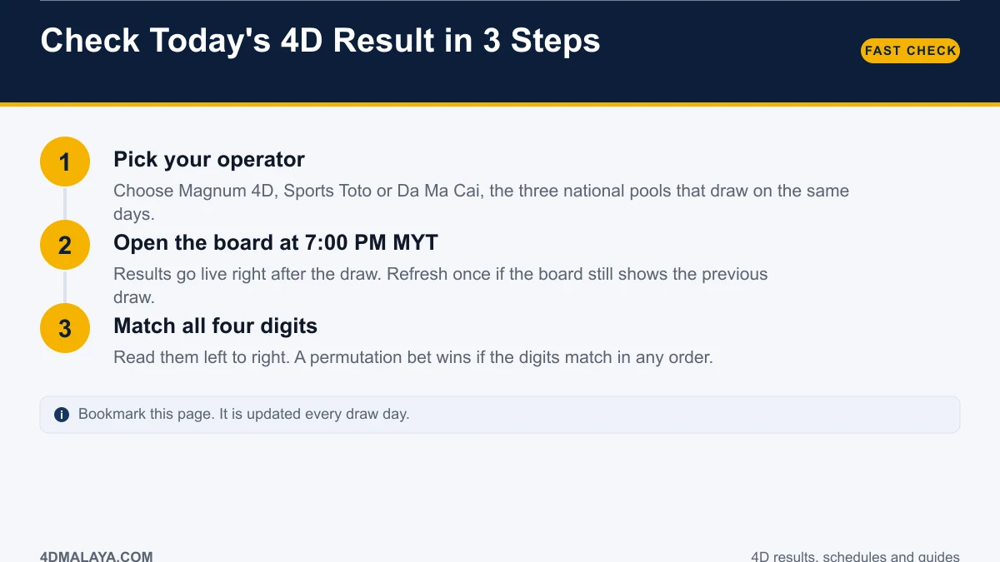
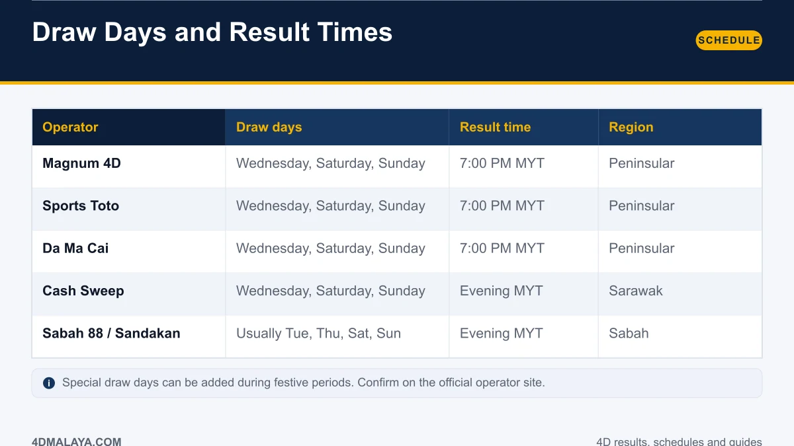
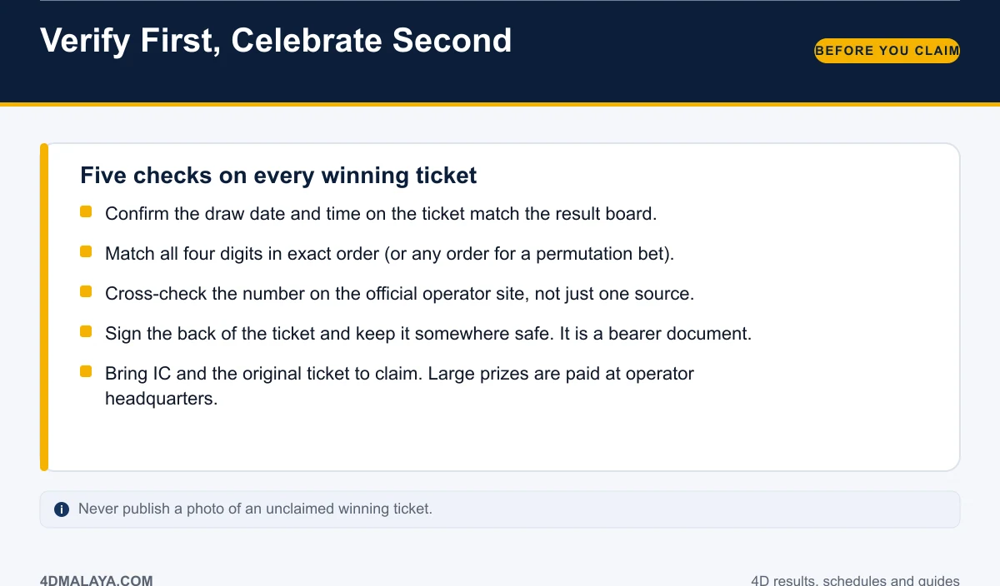

# 4D Result Today: Live Magnum, Sports Toto & Da Ma Cai Results

Every Wednesday, Saturday and Sunday evening, hundreds of thousands of Malaysians open a results board and start matching four digits. That single behaviour is the whole game: you want the number, fast, from a source you trust, without three browser tabs and a Telegram group that may be showing yesterday's draw.

This page is built to be the one tab you keep. Below you get today's draw window, a plain-English guide to reading the board, the full draw schedule, and a verification checklist that stops you from celebrating over a stale or wrong number.

*The 4D results hub covers the three national pools plus East Malaysian operators.*

## When is the 4D result out today?

The three national operators — **Magnum 4D, Sports Toto and Da Ma Cai** — all draw on the same pattern:

| Draw day | Operators | Result time |
|---|---|---|
| Wednesday | Magnum, Sports Toto, Da Ma Cai | ~7:00 PM MYT |
| Saturday | Magnum, Sports Toto, Da Ma Cai | ~7:00 PM MYT |
| Sunday | Magnum, Sports Toto, Da Ma Cai | ~7:00 PM MYT |

If today is not a draw day, there is no new national-pool board. East Malaysian pools such as Sabah 88 and Sandakan 4D commonly run on Tuesday, Thursday, Saturday and Sunday, and regional operators can draw daily — so a board may still exist for today even when the big three are quiet.

Results are published **within minutes of the draw**, and aggregators refresh shortly after. A board that has not appeared yet shows the previous draw; wait a few minutes and refresh once before assuming anything.

## How to read a 4D result board

A full board has 23 winning numbers. New players routinely check only the top three and miss a consolation win sitting in the list.

*Every section of the board, decoded.*

- **1st, 2nd and 3rd prize** — one number each. Your number must match all four digits in the exact order you played.
- **Special** — ten numbers. Pays on a Big bet.
- **Consolation** — ten numbers. Pays on a Big bet.

A Small bet only covers the top three. A Big bet covers all 23 positions. That one choice changes your payout more than most players realise — see [4D prize structure](4d-prize-structure/) for the full payout table.

## Check today's 4D result in 3 steps

1. **Pick your operator.** Magnum 4D, Sports Toto or Da Ma Cai — each publishes its own board for the same draw date.
2. **Open the board at 7:00 PM MYT.** Results go live right after the draw.
3. **Match all four digits, left to right.** If you bought a permutation or iBet entry, order does not matter — any arrangement of your digits counts.

The full tutorial, including apps and alerts, is in [how to check 4D results online](how-to-check-4d-result-online/).

## 4D draw schedule for this week

*Result times by operator and region.*

| Operator | Draw days | Result time | Region |
|---|---|---|---|
| Magnum 4D | Wed, Sat, Sun | 7:00 PM MYT | Peninsular |
| Sports Toto | Wed, Sat, Sun | 7:00 PM MYT | Peninsular |
| Da Ma Cai | Wed, Sat, Sun | 7:00 PM MYT | Peninsular |
| Cash Sweep | Wed, Sat, Sun | Evening MYT | Sarawak |
| Sabah 88 / Sandakan | Usually Tue, Thu, Sat, Sun | Evening MYT | Sabah |

Special draw days get added during festive periods. When that happens, an extra board appears on a date that is not a normal draw day — the [draw schedule guide](4d-draw-schedule/) explains how to catch them.

## Magnum, Sports Toto or Da Ma Cai: does it matter?

The prize structure is the same across all three: RM2,500 for a RM1 Big bet on 1st prize, RM180 on a special, RM60 on a consolation. What differs is where you bought the ticket and which board you must check. A Magnum ticket only wins on the Magnum draw. Checking the Sports Toto board will not tell you anything about your Magnum slip.

That is why the fastest path is a page that shows all three operators side by side instead of opening three official sites one after another.

## Before you celebrate: verify first

Five checks, every time:

1. **Draw date.** Your ticket's draw date must match the board you are reading.
2. **Exact digits, exact order** — unless the slip says permutation or iBet.
3. **Second source.** Confirm on the operator's official site before telling anyone.
4. **Sign the ticket.** A 4D ticket is a bearer document. Whoever holds it can claim.
5. **Claim properly.** IC and original ticket. Small prizes over the counter, big prizes at operator headquarters.

Do not post a photo of an unclaimed winning ticket. The digits plus the draw date are all someone needs.

## FAQ

### What time is the 4D result out in Malaysia?
About 7:00 PM MYT on draw days, shortly after the draw is held. Magnum, Sports Toto and Da Ma Cai publish on Wednesday, Saturday and Sunday. Publication can run a few minutes either side of 7pm.

### Is there a 4D draw every day?
Not for the national pools. Magnum, Sports Toto and Da Ma Cai draw three times a week. East Malaysian and regional operators run different, sometimes daily, schedules.

### What if today's result is not showing yet?
The board still shows the previous draw. Wait a few minutes and refresh once. If the draw was cancelled or rescheduled, the operator will announce it.

### Do permutation bets win on reversed digits?
Yes. A permutation entry covers multiple orderings of your digits, so a reversed or shuffled matching order still wins, at a reduced per-combination payout.

### How many numbers are on a 4D board?
Twenty-three: three top prizes, ten special and ten consolation numbers.

## The bottom line

Today's 4D result lands around 7:00 PM MYT on Wednesday, Saturday and Sunday for the three national pools. Read the whole board, match the draw date, verify on a second source, then protect the ticket. Everything else — systems, hot numbers, prediction apps — does not change a single digit.

<!-- PUBLISH NOTES
Internal links:
- -> /4d-prize-structure/ (anchor: payout table)
- -> /how-to-check-4d-result-online/
- -> /4d-draw-schedule/
- <- from /4d-results-history/, /4d-draw-schedule/, /types-of-4d-bets/ (hub link)
Schema: Article + FAQPage. Breadcrumb: Home > Results.
Category: Results. Tags: magnum, sports toto, da ma cai, live result.
Publish first. This is the money page: update the live board above the article daily.
-->
