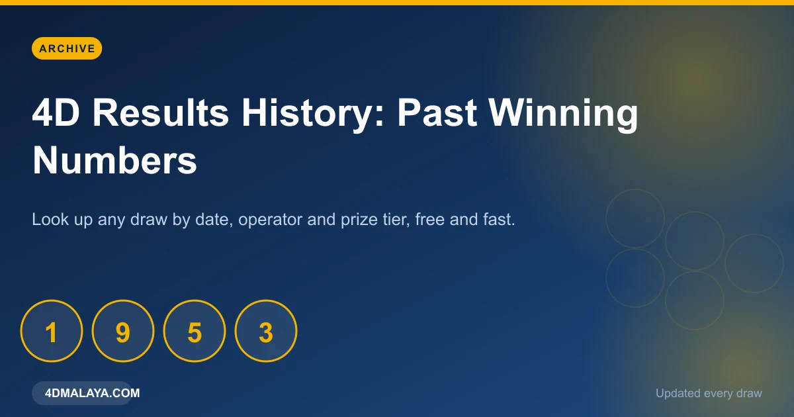
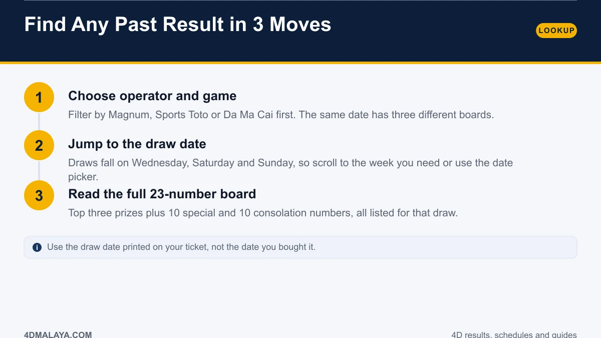
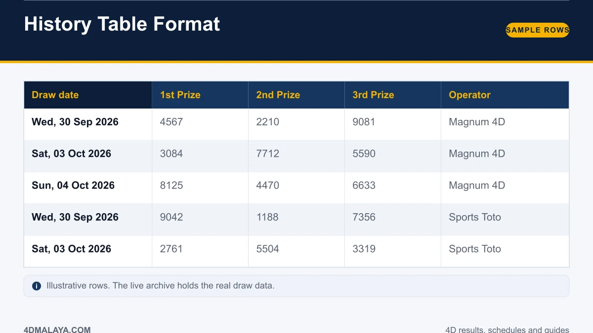
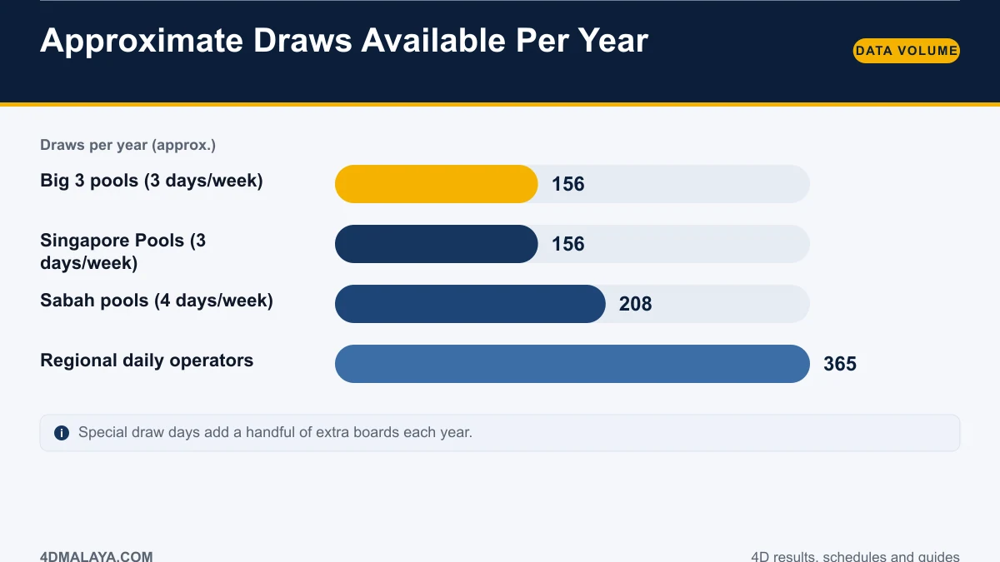
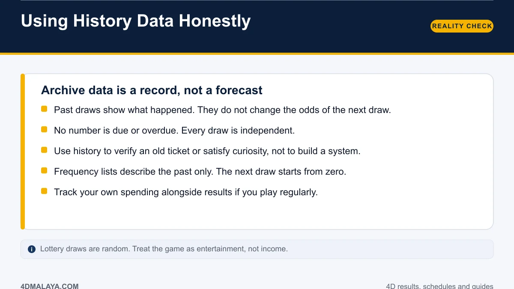

# 4D Results History: How to Look Up Past Winning Numbers

You either lost the ticket, missed the draw, or you are curious what came out six months ago. Whatever the reason, digging up an old 4D result should take seconds, not an afternoon of scrolling forums and screenshots with no dates on them.

This guide shows you how to pull any past board by date and operator, what a clean history record looks like, how much data actually exists per year, and — the part most sites skip — what historical data can and cannot legitimately tell you.

*One archive, every operator, every draw date.*

## Find any past result in 3 moves

1. **Choose operator and game.** Magnum, Sports Toto and Da Ma Cai each ran their own board on the same date. Filtering first prevents you reading the wrong numbers against your ticket.
2. **Jump to the draw date.** National-pool draws fall on Wednesday, Saturday and Sunday, so the week you need is easy to locate. Use the date printed on the ticket, not the purchase date — a ticket bought on Friday can be for a Sunday draw.
3. **Read the full 23-number board.** Top three prizes, ten special, ten consolation. Old tickets can win on a consolation number just as easily as a fresh one.

## What a proper history record looks like

*A clean record carries date, operator and every prize tier.*

Any archive worth using shows four things on every row:

- **Draw date** — the actual draw, not the publication timestamp.
- **Operator** — Magnum, Sports Toto, Da Ma Cai or East Malaysian pools.
- **All prize tiers** — not just the first prize. A consolation match still pays.
- **Source** — ideally traceable to the operator's own announcement.

Screenshots and forum posts fail all four tests. If you are checking an old ticket against a random WhatsApp forward, you are gambling on the accuracy of a stranger's typing.

## How much history exists?

*A decade of national-pool results is roughly 1,500 to 1,600 boards per operator.*

| Operator type | Regular pattern | Approx. draws per year |
|---|---|---|
| Magnum / Sports Toto / Da Ma Cai | 3 days a week | ~156 |
| Singapore Pools | 3 days a week | ~156 |
| Sabah 88 / Sandakan (usual) | 4 days a week | ~208 |
| Regional daily operators | Daily | ~365 |

Special draw days add a handful more, clustered around Chinese New Year, Deepavali, Hari Raya and year-end. Over ten years, a single national pool publishes more than 1,500 full boards — enough for genuine record-keeping, and enough to settle any argument about what came out on a specific date.

## Uses for history that actually hold up

- **Verify an old ticket.** The single most valuable use. Tickets are checked against the draw that printed on them, and forgetting a draw is more common than people admit.
- **Personal tracking.** If you play regularly, logging your own stakes against actual results gives you a brutally clear picture of your win rate. Most people have never done this arithmetic.
- **Research and content.** Journalists, app builders and analysts need dated, sourced boards. That is what a structured archive is for.
- **Settling disputes.** Date, operator, board. Three facts, no opinion.

## What history cannot do for you

Be blunt with yourself about the limits:

- **Past draws do not change future odds.** Every draw is a fresh mechanical event with no memory.
- **No number is due.** A number absent for two years has exactly the same 1-in-10,000 chance next draw as one drawn last week.
- **Frequency lists are descriptive.** They summarise what happened. They are not a forecast.
- **Short samples lie.** A hundred draws produce dramatic-looking streaks that mean nothing statistically.

The maths is covered properly in [4D odds explained](4d-odds-probability/) — including the expected return per ringgit, which is the number that matters more than any frequency table.

## FAQ

### How far back do 4D results go?
Malaysia's oldest pools have decades of published draws. National-pool 4D has run since the late 1960s, so a complete modern archive should cover every draw for the current era, with older results available from operator records.

### Can I check a 4D result by ticket serial number?
No. You check by draw date, operator and the four digits played. The serial number identifies the ticket, not the result.

### Are historical results free to view?
Yes. Public draw results are published by the operators and mirrored by result sites. Never pay for access to historical numbers.

### Does an old draw date mean an expired ticket?
Prize claim windows are set by the operator and can expire, sometimes within days or weeks of the draw. If you find an old winning ticket, claim immediately and check the operator's claim rules.

### Where can I get the data for analysis?
Use the official operator result pages as the source of record, then structure them by date. Scraping forums or social posts will corrupt your dataset with errors.

## The bottom line

A good 4D history lookup is a filter by operator and date, a full 23-number board, and a timestamp you can trust. Use it to verify tickets and track your own play. Do not use it to build a prediction system — the data will happily describe the past while refusing to forecast anything.

<!-- PUBLISH NOTES
Internal links:
- -> /4d-odds-probability/
- -> /4d-result-today/ (hub)
- -> /4d-draw-schedule/
- <- from /most-frequent-4d-numbers/, /4d-result-today/
Schema: Article + FAQPage. Breadcrumb: Home > Guides > History.
Monetization: place first in-content ad after step 2; archive pages (future
programmatic /YYYY/MM/DD/ result pages) link here as the explainer.
-->
