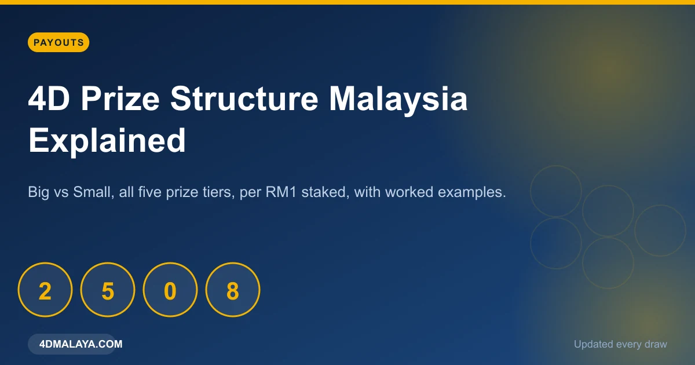
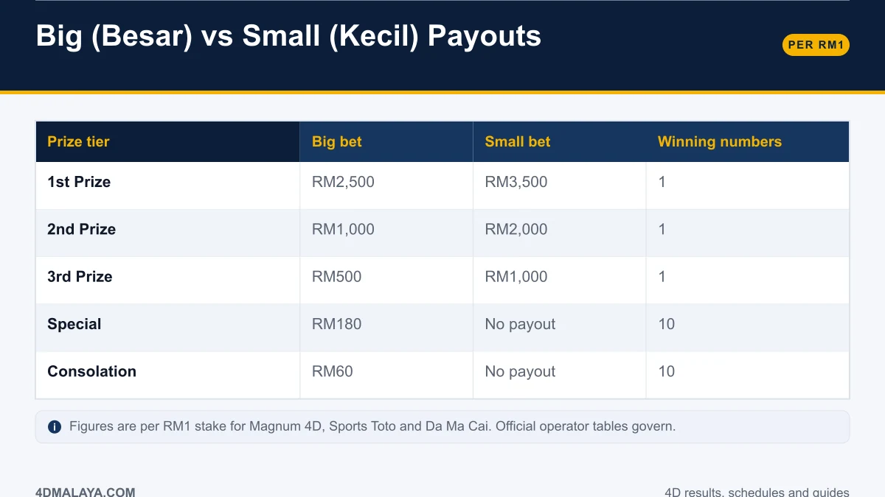
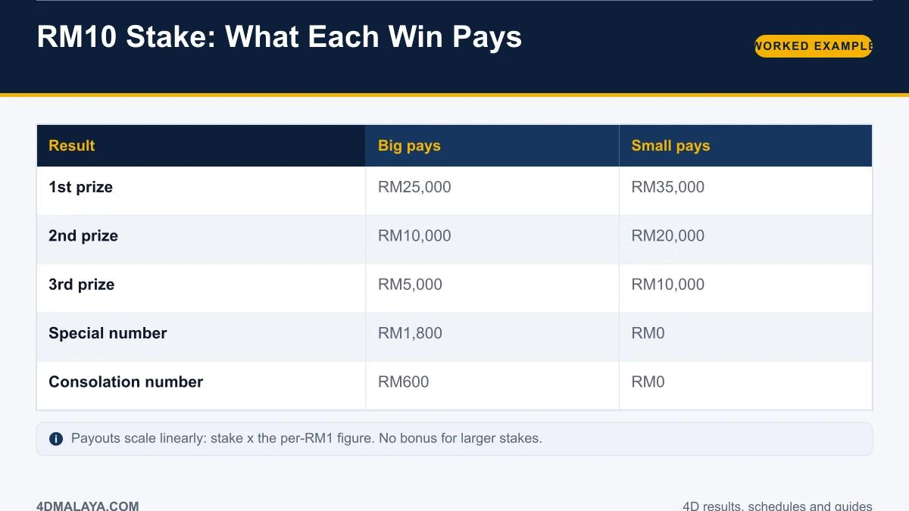
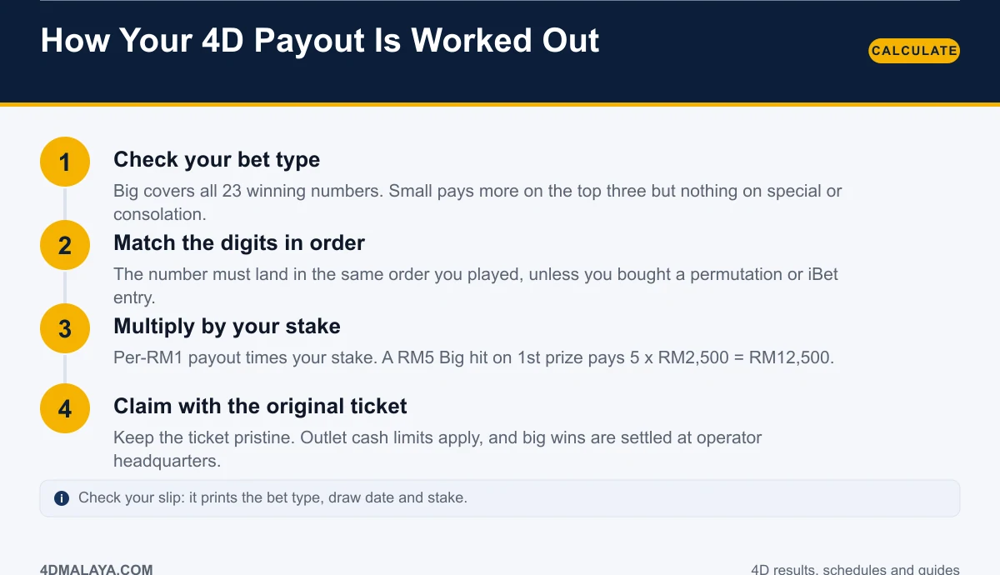
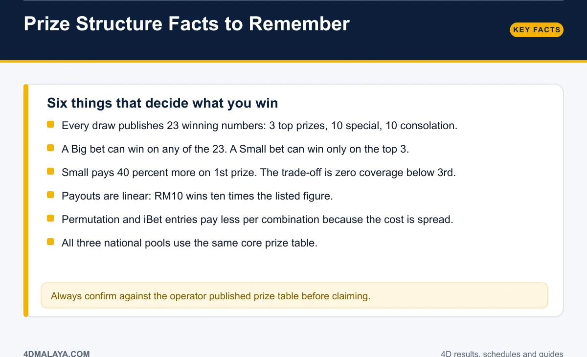

# 4D Prize Structure Malaysia: Big vs Small Payouts Explained

Every 4D ticket in Malaysia is priced off the same core table. Learn that table once and you will never again squint at a payout figure wondering whether it includes your stake, your bet type, or some operator surcharge.

The short version: **a RM1 Big bet on 1st prize pays RM2,500. A RM1 Small bet pays RM3,500.** The longer version covers five prize tiers, 23 winning numbers, and the trade-off that makes Big and Small genuinely different products rather than cosmetic labels.

*All figures below are per RM1 staked.*

## Big vs Small: the full prize structure

| Prize tier | Big (Besar) | Small (Kecil) | Winning numbers |
|---|---|---|---|
| 1st Prize | RM2,500 | RM3,500 | 1 |
| 2nd Prize | RM1,000 | RM2,000 | 1 |
| 3rd Prize | RM500 | RM1,000 | 1 |
| Special | RM180 each | No payout | 10 |
| Consolation | RM60 each | No payout | 10 |

Magnum 4D, Sports Toto and Da Ma Cai all run this same core structure for their standard 4D game. Always confirm against the operator's published table before you claim, but you should not find a surprise.

### The trade-off in one line

**Big covers all 23 winning numbers. Small covers only the top three — and pays more when it hits.**

A Big bet is the safer, lower-variance option: any special or consolation match still returns something. A Small bet is a concentrated bet on the top three, with a 40 percent higher 1st-prize payout and zero return below 3rd.

## RM10 stake: what each win actually pays

Payouts scale linearly with your stake. There is no bonus for betting big and no threshold that changes the rate.

| Result | Big pays (RM10 stake) | Small pays (RM10 stake) |
|---|---|---|
| 1st prize | RM25,000 | RM35,000 |
| 2nd prize | RM10,000 | RM20,000 |
| 3rd prize | RM5,000 | RM10,000 |
| Special | RM1,800 | RM0 |
| Consolation | RM600 | RM0 |

So a RM5 Big hit on 1st prize pays 5 x RM2,500 = **RM12,500**. A RM2 Small hit on 3rd prize pays 2 x RM1,000 = **RM2,000**. The arithmetic never changes: stake multiplied by the per-RM1 figure.

## How your 4D payout is worked out

1. **Check your bet type.** Big or Small is printed on the slip. This decides which tiers you are eligible for.
2. **Match the digits in order.** Straight bets require the exact sequence you played. Permutation and iBet entries cover multiple orderings.
3. **Multiply by your stake.** Per-RM1 payout times your stake, rounded by the operator's rules.
4. **Claim with the original ticket.** Sign the back. Outlets pay small prizes over the counter; large prizes are settled at operator headquarters with IC.

Permutation and iBet entries are priced differently because your stake is spread across many combinations. The full grid is in [types of 4D bets](types-of-4d-bets/).

## Six facts that decide your payout

- **23 winning numbers per draw.** Three top prizes, ten special, ten consolation.
- **Big = all 23. Small = top 3 only.** This matters more than the headline percentage.
- **Small pays 40 percent more on 1st prize** (RM3,500 vs RM2,500) with no consolation coverage.
- **Payouts are linear.** Stake size never improves your rate per ringgit.
- **Permutation/iBet pay less per combination.** You are buying coverage, not extra value.
- **All three national pools share the core table.** The number you bet on does not change the structure.

## Why the structure matters more than the hype

The prize table is where the house edge lives. On a Big bet, the expected return per RM1 works out at roughly **64 sen**; on a Small bet, about **65 sen**. Neither figure is a criticism of the operators — it is simply what the numbers say, and it is unpacked fully in [4D odds explained](4d-odds-probability/).

What the structure does tell you is how to behave as a buyer: pick Big or Small deliberately, know your tier coverage before the draw, and never let a "guaranteed system" pitch talk you into a stake size the maths does not support.

## FAQ

### What is the 1st prize for a RM1 4D bet?
RM2,500 on a Big bet and RM3,500 on a Small bet, for Magnum, Sports Toto and Da Ma Cai standard 4D.

### Does a Big bet win on special and consolation numbers?
Yes. Big covers all 23 published winning numbers: RM180 for each special and RM60 for each consolation, per RM1 staked.

### Why does Small pay more?
Small removes the operator's exposure on 20 of the 23 numbers, so it pays a premium on the top three instead.

### Do I win if my digits are in the wrong order?
Not on a straight (fixed) bet. Permutation and iBet entries cover multiple orderings at a reduced per-combination payout.

### Are prizes taxed in Malaysia?
One-off gambling winnings are generally treated as windfall rather than income for most players, but frequent, systematic play can be viewed differently. Read [4D winnings and tax in Malaysia](4d-winnings-tax-malaysia/) for the full picture.

## The bottom line

Learn one table: **RM2,500 / RM1,000 / RM500 / RM180 / RM60 for Big, and RM3,500 / RM2,000 / RM1,000 for Small, all per RM1.** Everything else — stake multipliers, permutation grids, bet-type strategy — is arithmetic on top of those five numbers. Confirm against the operator's official table, keep the original ticket, and know your tier coverage before you buy.

<!-- PUBLISH NOTES
Internal links:
- -> /4d-odds-probability/ (expected return)
- -> /types-of-4d-bets/ (permutation payouts)
- -> /4d-winnings-tax-malaysia/
- <- from /4d-result-today/, /types-of-4d-bets/
Schema: Article + Table (prize structure) + FAQPage. Breadcrumb: Home > Guides > Payouts.
This page converts: comparison/intent traffic. First ad after the Big/Small table.
-->
