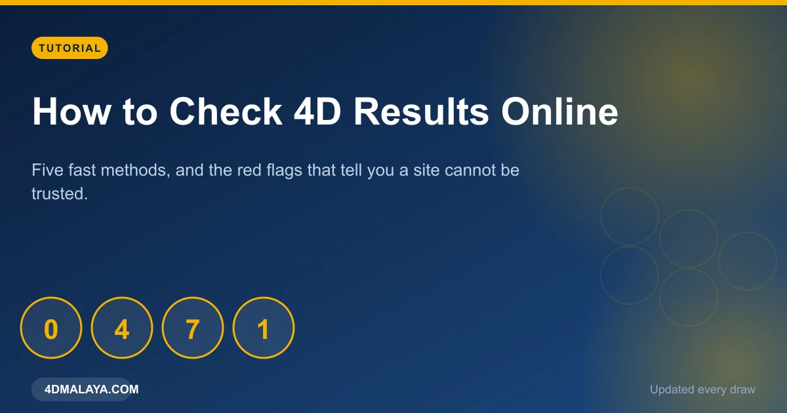
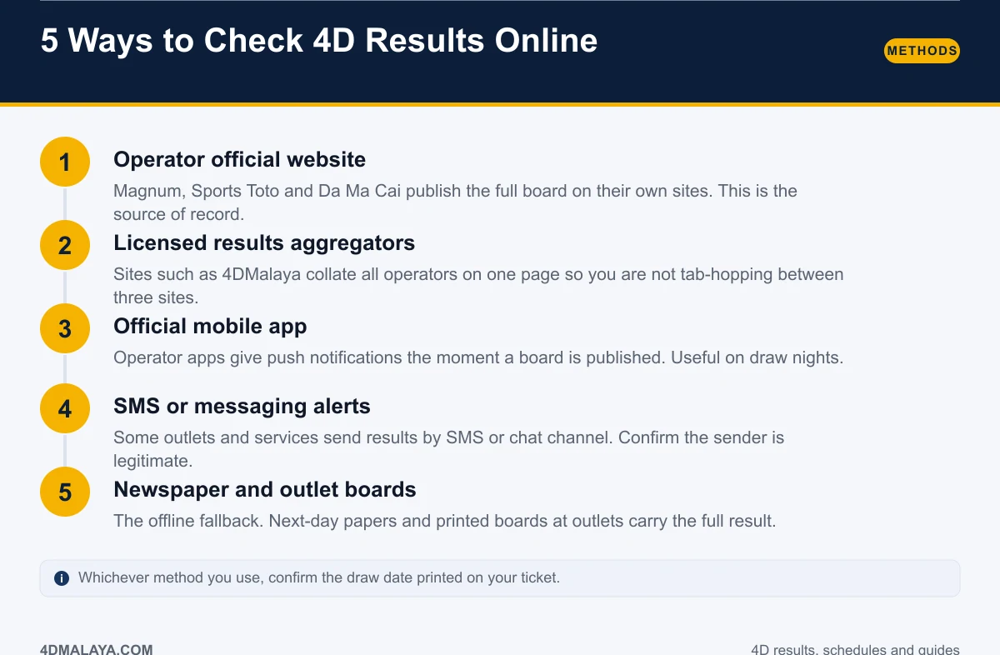
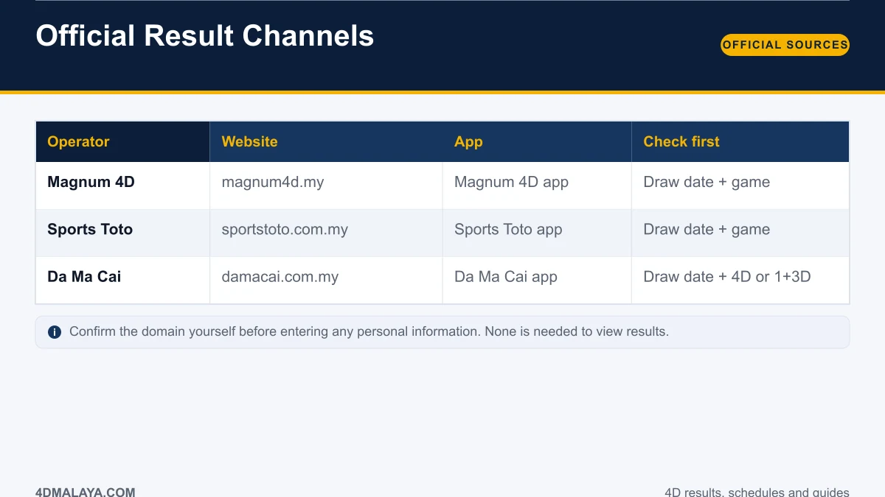
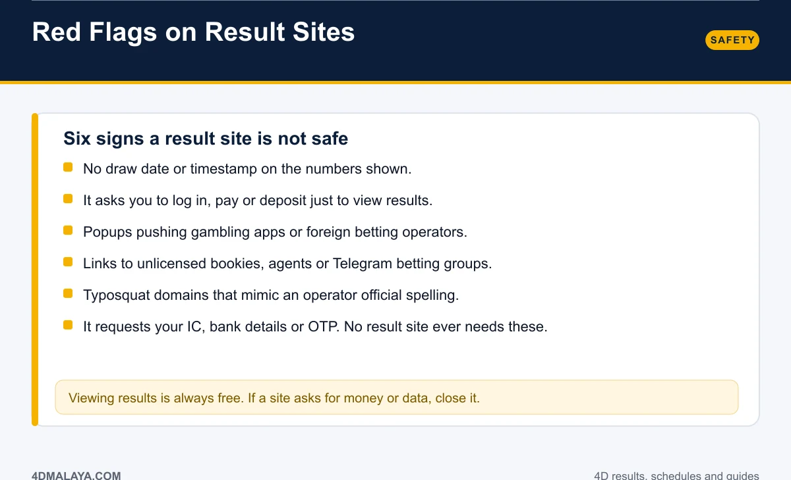
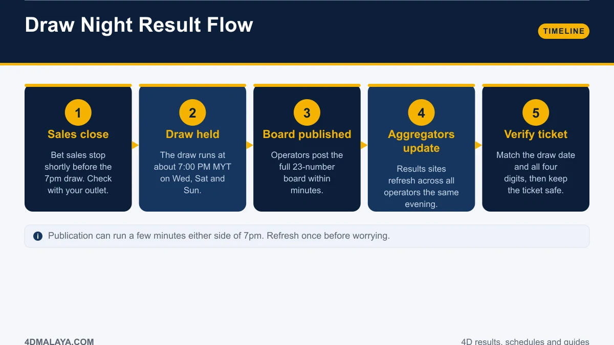

# How to Check 4D Results Online: 5 Fast, Safe Methods

Checking a 4D result should be trivial. It is four digits and a date. Yet the internet has filled the space with sites that show stale boards, sites that ask for your IC to "verify" a result, and links into unlicensed betting operations dressed up as a results service.

This guide ranks the five reliable methods from most to least authoritative, gives you the official channels for each operator, and finishes with the red flags that tell you to close a tab immediately.

*Five methods. One rule: checking results should always be free.*

## The 5 methods, ranked

### 1. The operator's official website
The source of record. Magnum, Sports Toto and Da Ma Cai publish the full board for every draw on their own sites. If you need certainty — a big ticket, a dispute, a claim — this is where you go.

### 2. A results aggregator
Aggregators collate all operators onto one page so you are not tab-hopping between three sites on a draw night. This is the everyday method: fast, complete, zero logins. Use one you trust and that shows a draw date and timestamp on every board.

### 3. The operator's mobile app
Best for alerts. Operator apps push a notification the moment the board is published, which beats refreshing a browser at 7:05 PM. Install the app from the official store listing, not from a link inside a results page.

### 4. SMS or messaging alerts
Some outlets and services send results by SMS or chat channel. Convenient, but verify the sender. An unverified number sending "results" is also how phishing attempts arrive.

### 5. Newspaper and outlet boards
The offline fallback. Next-day papers and printed boards at outlets carry the full result. Slow, but unimpeachable.

## Official channels per operator

| Operator | Website | App | Check first |
|---|---|---|---|
| Magnum 4D | magnum4d.my | Magnum 4D app | Draw date + game |
| Sports Toto | sportstoto.com.my | Sports Toto app | Draw date + game |
| Da Ma Cai | damacai.com.my | Da Ma Cai app | Draw date + 4D or 1+3D |

Confirm the domain yourself rather than clicking a search ad. Search results above the organic listings are frequently occupied by third-party operators, and typosquat domains are common in this niche. **No legitimate result site asks for personal information to display a draw board.**

## Six red flags on a result site

1. **No draw date or timestamp.** Numbers with no date are useless — you cannot tell which draw you are reading.
2. **It wants a login, deposit or payment.** Viewing results is free, always.
3. **Popups pushing gambling apps**, especially foreign operators or APK downloads.
4. **Links to unlicensed bookies**, agents or Telegram betting groups. That is where the legal risk sits.
5. **Typosquat domains** mimicking an operator's spelling with a letter swapped.
6. **Requests for IC, bank details or an OTP.** No result site needs these. Ever.

If a site shows two of the above, close it and use an official channel instead.

## Draw night: what happens end to end

1. **Sales close** shortly before the draw — ask your outlet for its exact cut-off.
2. **The draw is held** at about 7:00 PM MYT on Wednesday, Saturday and Sunday.
3. **The official board is published** within minutes by the operator.
4. **Aggregators refresh** across all operators the same evening.
5. **You verify the ticket** against the draw date and all four digits, then keep it safe.

Publication can run a few minutes either side of 7 PM. Refresh once before concluding anything is wrong. The full calendar is in the [4D draw schedule](4d-draw-schedule/).

## A quick note on what not to do

Do not enter your IC, bank details or OTP on any site to view or "unlock" results. Do not download APK files from results pages. Do not send money for tips, predictions or early numbers — there is no such thing as an early number, and anyone claiming otherwise is running a scam.

If you want to improve anything about your play, improve your record-keeping and your stake discipline. Both are covered in [4D prize structure](4d-prize-structure/) and [4D odds explained](4d-odds-probability/).

## FAQ

### Where can I check 4D results for free?
On the operator's official site, on a trusted results aggregator, or in the operator's app. All three are free. Never pay to view a result.

### How soon after the draw are results online?
Usually within minutes of the 7:00 PM MYT draw on Wednesday, Saturday and Sunday. Aggregators typically refresh shortly after the operator publishes.

### Is there an official 4D result app?
Each operator publishes its own app. Use the listing from the official store and verify the developer name matches the operator.

### Why does one site show a different result from another?
Almost always a mismatched draw date or operator. Compare the date and the game type first. If both genuinely disagree, trust the operator's own site.

### Can I check results by ticket number?
No. You match the four digits played against the board for the draw date printed on the ticket.

## The bottom line

Use the operator site when it matters and a trusted aggregator on ordinary draw nights. Never pay, never hand over personal data, never follow a betting link from a results page. If a site shows a date and a timestamp and asks for nothing, you are probably fine — if it asks for anything else, you are not.

<!-- PUBLISH NOTES
Internal links:
- -> /4d-draw-schedule/
- -> /4d-prize-structure/
- -> /is-4d-legal-malaysia/ (unlicensed betting links)
- <- from /4d-result-today/, /is-4d-legal-malaysia/
Schema: Article + HowTo + FAQPage. Breadcrumb: Home > Guides > How To.
High long-tail intent (tutorial queries). First ad after the methods list.
-->
