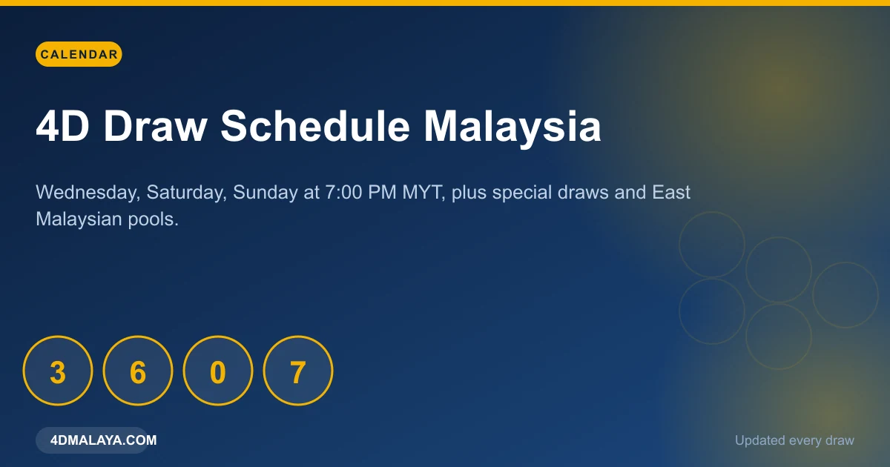
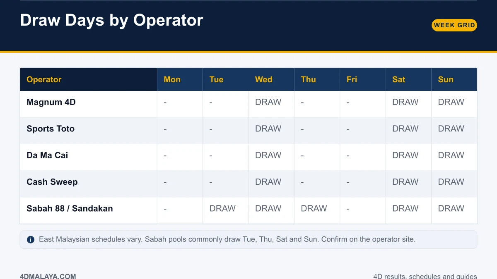
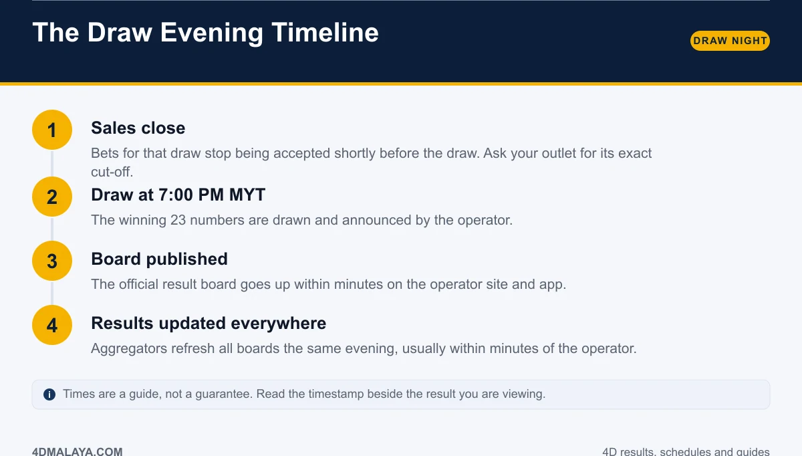
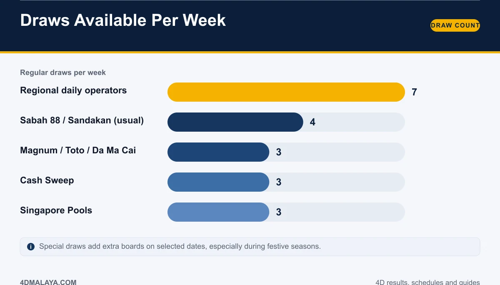
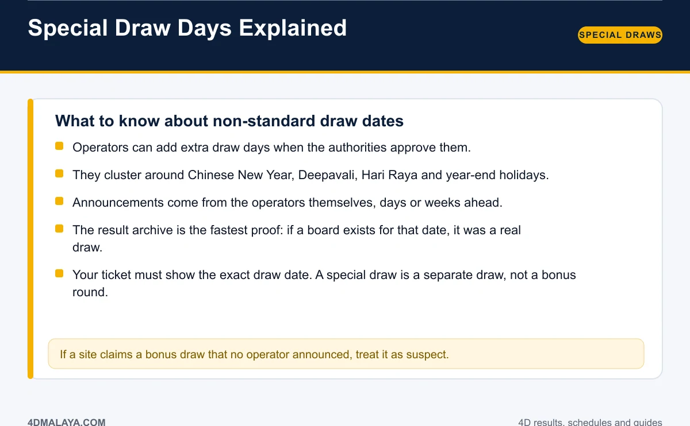

# 4D Draw Schedule Malaysia: Days, Times & Special Draws

Three draw days a week, one clock time, and a handful of exceptions that catch people out. That is the entire Malaysian 4D calendar for the national pools — but the exceptions matter, because a ticket bought for the wrong draw is worth nothing.

Here is the full weekly grid by operator, what happens on a draw evening minute by minute, how many draws each week actually offers, and how special draw days work.

*Wednesday, Saturday, Sunday at 7:00 PM MYT for the national pools.*

## Draw days by operator

| Operator | Mon | Tue | Wed | Thu | Fri | Sat | Sun |
|---|---|---|---|---|---|---|---|
| Magnum 4D | – | – | **Draw** | – | – | **Draw** | **Draw** |
| Sports Toto | – | – | **Draw** | – | – | **Draw** | **Draw** |
| Da Ma Cai | – | – | **Draw** | – | – | **Draw** | **Draw** |
| Cash Sweep | – | – | **Draw** | – | – | **Draw** | **Draw** |
| Sabah 88 / Sandakan | – | **Draw** | **Draw** | **Draw** | – | **Draw** | **Draw** |

**The pattern for Magnum, Sports Toto and Da Ma Cai: Wednesday, Saturday and Sunday, results at about 7:00 PM MYT.** All three national pools publish the same evening, so a single check covers Peninsular Malaysia's main boards.

East Malaysian schedules differ. Sabah 88 and Sandakan 4D commonly run Tuesday, Thursday, Saturday and Sunday; Cash Sweep follows the Wednesday, Saturday and Sunday pattern. Regional operators may draw daily. When accuracy matters — a real ticket, a real claim — confirm on the operator's own site rather than on a memory of a schedule.

## The draw evening timeline

1. **Sales close.** Betting on that draw stops shortly before the draw itself. Cut-off times differ by outlet and channel; ask yours rather than guessing.
2. **Draw at 7:00 PM MYT.** The winning 23 numbers are drawn and announced by the operator.
3. **Board published.** The full result board goes up within minutes on the operator's website and app.
4. **Results updated everywhere.** Aggregators refresh all boards the same evening, usually within minutes of the operator.

Treat these times as a window rather than a contract. The reliable signal is the timestamp next to the result you are reading — if it shows an older draw, the new board has not landed yet.

## How many draws per week?

| Operator group | Regular draws per week |
|---|---|
| Regional daily operators | 7 |
| Sabah 88 / Sandakan (usual) | 4 |
| Magnum / Sports Toto / Da Ma Cai | 3 |
| Cash Sweep | 3 |
| Singapore Pools | 3 |

More draws means more opportunities to check — and more opportunities to spend. The national pools' three-a-week rhythm is actually a natural budgeting boundary if you treat it as one.

## Special draw days explained

Special draws are extra, non-standard draw dates approved for the operators:

- **They are approved, not improvised.** Operators add them when the authorities permit, and they announce them ahead of time.
- **They cluster around festive periods** — Chinese New Year, Deepavali, Hari Raya and the year-end period, when betting volume peaks.
- **The archive is the fastest proof.** If a board exists for that date with a timestamp, it was a real draw.
- **A special draw is a separate draw.** Your ticket shows its draw date; it is not a bonus round attached to the regular draw.
- **If nobody announced it, treat it as suspect.** Fake "bonus draws" are a staple of scam result pages.

Because special dates are announced in advance, the smart move is to bookmark the schedule page and check it before a festive period rather than discovering an extra draw the morning after.

## Why the schedule matters for your ticket

Every ticket prints a draw date. That date is the contract:

- Bought Saturday for the Saturday draw? It is only valid for Saturday's board.
- A Sunday result will not pay a Saturday ticket, regardless of the digits.
- Buying before a special draw requires confirming which draw your slip is entering.

Printed slips show the draw date, the game, the bet type and the stake. Read all four before you leave the counter — it takes five seconds and prevents the most common "wrong result" complaints there are.

The consequence side is covered in [4D prize structure](4d-prize-structure/), and the checking workflow is in [how to check 4D results online](how-to-check-4d-result-online/).

## FAQ

### What days are 4D draws in Malaysia?
Magnum, Sports Toto and Da Ma Cai draw on Wednesday, Saturday and Sunday. East Malaysian and regional operators follow different patterns, sometimes including Tuesday and Thursday or daily draws.

### What time is the 4D draw?
About 7:00 PM MYT on draw days for the national pools, with the result board published within minutes.

### Are there 4D draws on Monday or Friday?
Not for the national pools under the regular schedule. Regional operators may still draw on other days.

### What is a special draw?
An extra draw date approved for the operators and announced in advance, usually around major festive periods. It is a separate draw with its own board.

### Do all operators draw on the same day?
The big three do — Wednesday, Saturday and Sunday. Beyond that, schedules vary by operator and region.

## The bottom line

Circle Wednesday, Saturday and Sunday. Set an evening reminder for 7:00 PM MYT. Confirm special dates from the operator's own announcement, not from a forwarded message. Everything about the 4D calendar fits on one page — and now you have it.

<!-- PUBLISH NOTES
Internal links:
- -> /4d-result-today/ (hub)
- -> /how-to-check-4d-result-online/
- -> /4d-results-history/
- <- from /4d-result-today/, /4d-results-history/
Schema: Article + Table (weekly grid) + FAQPage. Breadcrumb: Home > Guides > Schedule.
Supports "next draw" and "4D draw date" queries. Link from the homepage calendar widget.
-->
