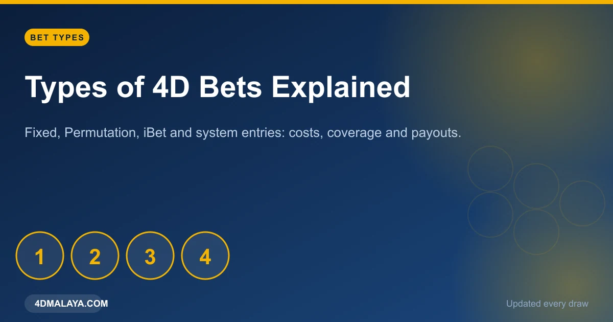
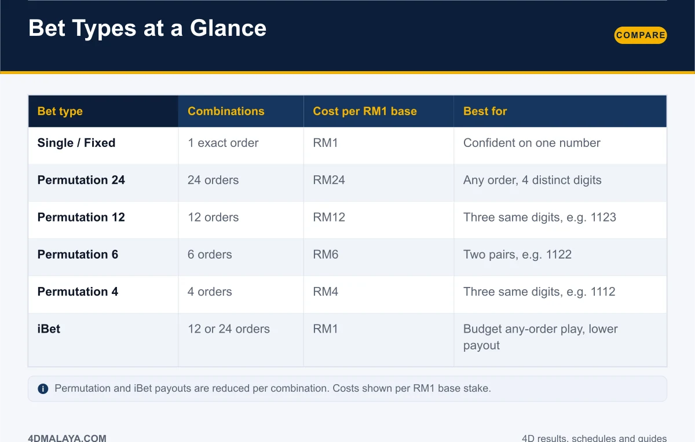
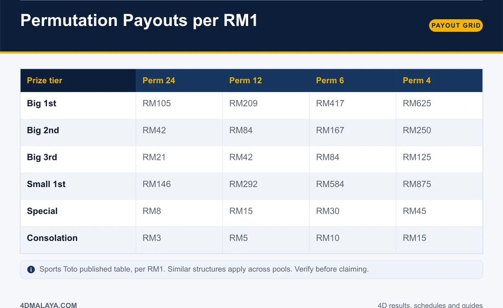
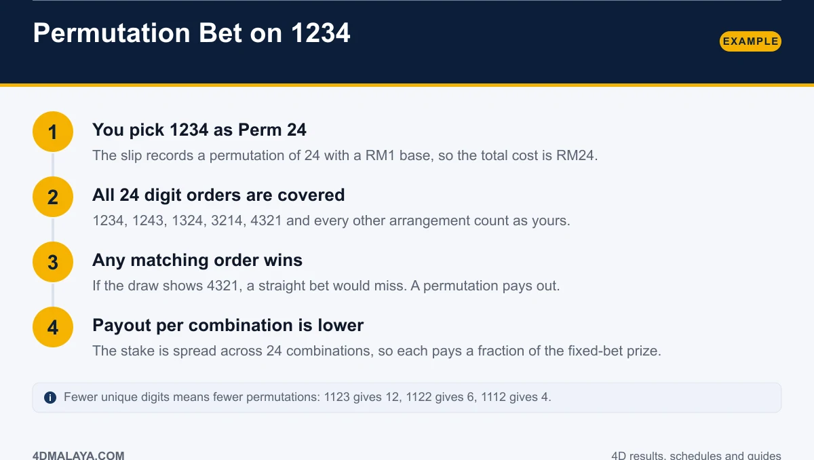
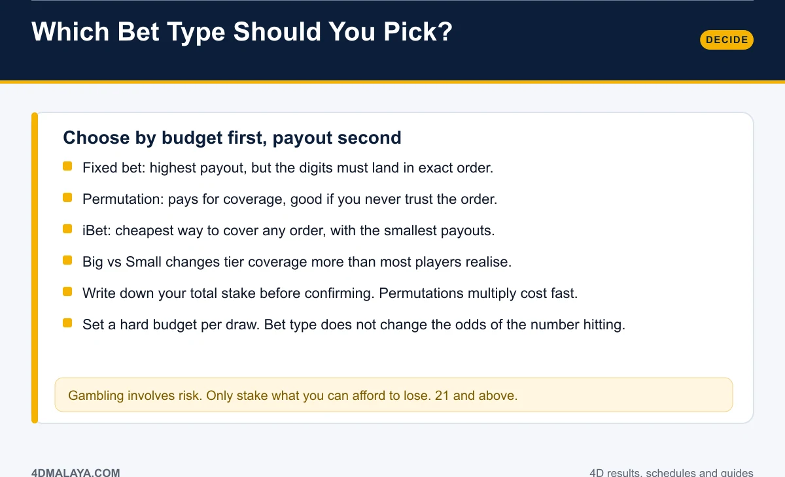

# Types of 4D Bets Explained: Fixed, Perm, iBet & More

The bet type printed on your slip decides two things: **how many orderings of your digits are covered, and how much each one pays.** Get that wrong and you either overpay for coverage you did not want or miss a win you thought you had.

This guide walks through every common 4D entry type — single (fixed), permutation 24/12/6/4 and iBet — with real combination counts, costs and the official payout grid.

*Every entry type on the slip, decoded.*

## Bet types at a glance

| Bet type | Combinations | Cost per RM1 base | Best for |
|---|---|---|---|
| Single / Fixed | 1 exact order | RM1 | Confidence in one number, exact order |
| Permutation 24 | 24 orders | RM24 | Any order, four distinct digits |
| Permutation 12 | 12 orders | RM12 | Three same digits, e.g. 1123 |
| Permutation 6 | 6 orders | RM6 | Two pairs, e.g. 1122 |
| Permutation 4 | 4 orders | RM4 | Three same digits, e.g. 1112 |
| iBet | 12 or 24 orders | RM1 | Budget any-order play, smaller payout |

The combination count is not arbitrary — it comes from the digits you choose. Distinct digits generate the maximum orderings; repeated digits collapse them.

## Why 1123 gives 12 and 1112 gives 4

Permutation counts depend on repeated digits:

- **All four digits different (1234):** 4! = **24** orderings.
- **One digit repeated twice (1123):** 24 ÷ 2 = **12** orderings.
- **Two pairs (1122):** 24 ÷ 4 = **6** orderings.
- **Three of a kind (1112):** 24 ÷ 6 = **4** orderings.

So a slip marked "Perm 12" is a signal that your number contains a repeat. If you did not intend that, read the slip again before you pay.

## The permutation payout grid

Published permutation payouts per RM1 base stake:

| Prize tier | Perm 24 | Perm 12 | Perm 6 | Perm 4 |
|---|---|---|---|---|
| Big — 1st | RM105 | RM209 | RM417 | RM625 |
| Big — 2nd | RM42 | RM84 | RM167 | RM250 |
| Big — 3rd | RM21 | RM42 | RM84 | RM125 |
| Small — 1st | RM146 | RM292 | RM584 | RM875 |
| Special | RM8 | RM15 | RM30 | RM45 |
| Consolation | RM3 | RM5 | RM10 | RM15 |

Read that table against a straight bet's RM2,500 1st prize and the trade-off is obvious: **you are buying order-insensitivity at roughly a tenth of the top payout.** Fewer combinations per entry means a higher figure per combination, which is why Perm 4 pays more than Perm 24 on every tier.

Similar structures apply across pools — verify the current table on the operator's official site before claiming.

## How a permutation bet works: 1234

1. **You pick 1234 as Perm 24** with a RM1 base. The total cost is RM24.
2. **All 24 orderings are covered** — 1234, 1243, 1324, 3214, 4321 and the rest.
3. **Any matching order wins.** If the draw shows 4321, a straight bet misses and a permutation pays.
4. **Each combination pays a fraction.** The stake is spread across 24 entries, so the payout per entry drops accordingly.

If you want the same coverage on a tighter budget, that is exactly what iBet is for: the same permutation set at a RM1 outlay with a smaller payout attached.

## Fixed vs permutation vs iBet: choosing

**Fixed (single)** — highest payout, narrowest coverage. Right when you are playing one number and accept that order matters.

**Permutation** — pays for coverage. Right when you never trust the order, and you accept the payout reduction.

**iBet** — cheapest any-order coverage. Right for small stakes across more entries. The payout is the lowest of the three.

And underneath all of it sits Big vs Small: Big covers all 23 winning numbers, Small covers the top three at a premium. That choice is laid out in the [4D prize structure](4d-prize-structure/) table.

### Before you confirm the slip

- Write down the **total** cost: base x combinations x stake. Permutations multiply fast.
- Check the **bet type** printed on the slip against what you asked for.
- Set a **fixed budget per draw** and stop when it is spent. Bet type changes coverage, not the underlying odds.

The odds themselves — 10,000 combinations, 1-in-10,000 on any exact number — are covered in [4D odds explained](4d-odds-probability/). No entry type changes them.

## FAQ

### What is the difference between a fixed and a permutation bet?
A fixed bet wins only when the digits land in the exact order played. A permutation bet covers every ordering of your digits at a proportionally higher cost and lower payout per combination.

### How much does a 24-permutation 4D bet cost?
With a RM1 base, a Perm 24 entry costs RM24, because it covers 24 orderings. Costs scale linearly with your base stake.

### What is iBet?
An any-order entry that covers a permutation set (commonly 12 or 24 combinations) for a RM1 outlay, with payouts reduced accordingly. It is the budget option for order-independent play.

### Does permutation work with repeated digits?
Yes, but the combination count falls: 1123 gives 12, 1122 gives 6, 1112 gives 4. The slip reflects the actual number of orderings covered.

### Which 4D bet type has the best odds?
None of them. Odds of your number hitting are fixed by the 10,000 possible combinations. Bet types only change what you are paid and how many orderings you cover.

## The bottom line

Fixed pays most and requires exact order. Permutation buys order-insensitivity at a cost multiplier. iBet buys it cheapest, with the smallest payout. Pick by budget first, know the combination count on your slip, and never confuse a wider coverage bet with better odds — the odds do not move.

<!-- PUBLISH NOTES
Internal links:
- -> /4d-prize-structure/
- -> /4d-odds-probability/
- -> /4d-result-today/
- <- from /4d-prize-structure/, /4d-result-today/
Schema: Article + Table + FAQPage. Breadcrumb: Home > Guides > Bet Types.
Strong intent query ("iBet", "permutation"). Comparison table = good ad placement anchor.
-->
