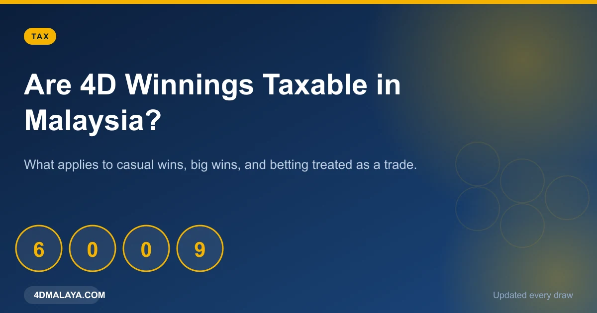
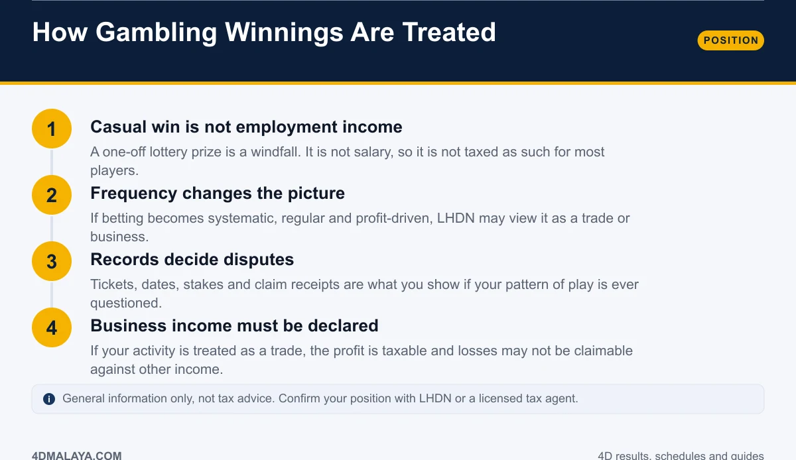
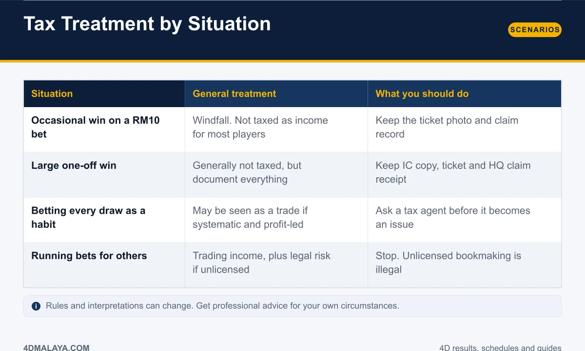
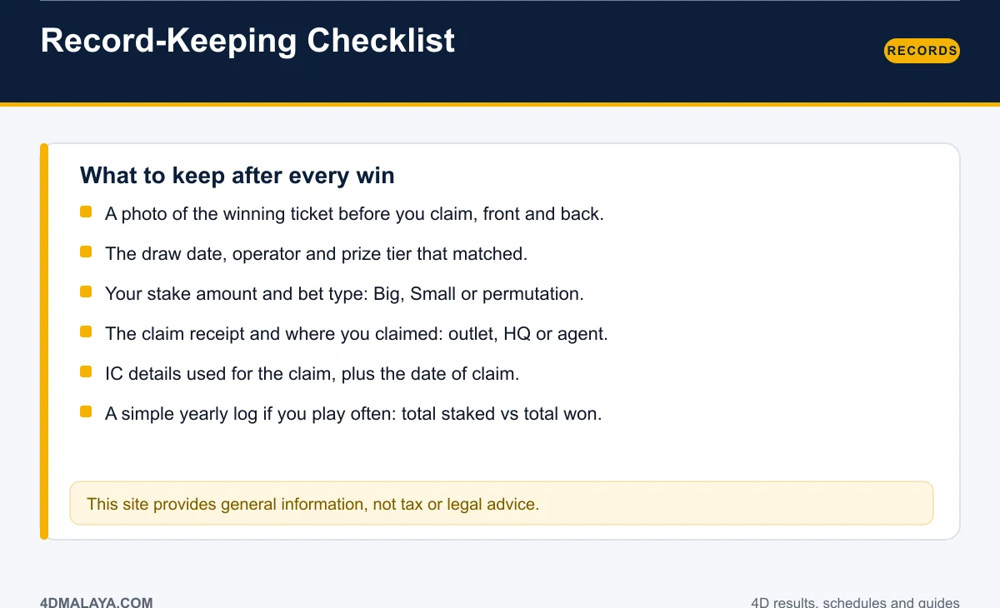
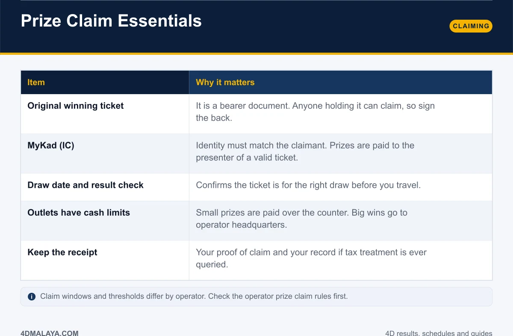

# Are 4D Winnings Taxable in Malaysia? Straight Answers

It is the question that arrives the moment someone wins: **do I have to pay tax on this?** The answer for most casual players is straightforward, and the answer for a few situations is not. Knowing which camp you are in before you claim saves you a headache later.

This guide covers how gambling winnings are generally treated in Malaysia, what changes when betting starts looking like a trade, the records worth keeping, and exactly what to bring when claiming a prize.

*General information only — not tax advice.*

## How gambling winnings are generally treated

1. **A casual win is not employment income.** A one-off lottery prize is a windfall. It is not salary or business revenue, so for most players it is not taxed as income.
2. **Frequency changes the picture.** If betting becomes systematic, regular and profit-driven, the activity can start to look like a trade or business rather than a pastime.
3. **Records decide disputes.** Tickets, dates, stakes and claim receipts are what you produce if your pattern of play is ever questioned.
4. **Business income must be declared.** If the activity is treated as a trade, the profit falls within the tax net, and losses may not be deductible against other sources of income.

These are general principles, not a ruling on your circumstances. Positions can and do vary with the facts, and rules change. For anything beyond a modest one-off win, confirm directly with LHDN or a licensed tax agent before you file anything.

## Tax treatment by situation

| Situation | General treatment | What you should do |
|---|---|---|
| Occasional win on a RM10 bet | Windfall — not taxed as income for most players | Keep the ticket photo and claim record |
| Large one-off win | Generally not taxed, but document everything | Keep IC copy, ticket and HQ claim receipt |
| Betting every draw as a habit | May be seen as a trade if systematic and profit-led | Ask a tax agent before it becomes an issue |
| Running bets for others | Trading income, plus serious legal risk if unlicensed | Stop — unlicensed bookmaking is illegal |

Two of those rows deserve emphasis:

- **Large wins attract attention.** Not because the prize is automatically taxable, but because the paper trail suddenly matters. Keep every document.
- **Betting for other people is a different animal entirely.** It is income-bearing activity *and* potentially criminal if unlicensed. See [is 4D legal in Malaysia](is-4d-legal-malaysia/) before you go anywhere near it.

## Record-keeping checklist

Keep these from every claim:

- **A photo of the winning ticket**, front and back, taken before you claim.
- **Draw date, operator and prize tier** that matched.
- **Stake amount and bet type** — Big, Small or permutation.
- **Claim receipt** and where you claimed: outlet, headquarters or agent.
- **IC details used** and the date of claim.
- **A yearly log** if you play often: total staked versus total won.

That last line is the one most people skip, and it is the line that gives you a clean, defensible answer if anyone ever asks how your play has been running. It also answers a question you may not want answered — which is exactly why it is worth keeping.

## What to bring when claiming a prize

| Item | Why it matters |
|---|---|
| Original winning ticket | A bearer document — sign the back before anything else |
| MyKad (IC) | Identity must match the claimant |
| Draw date + result check | Confirms the ticket is for the right board before you travel |
| Awareness of cash limits | Small prizes over the counter; big wins at operator headquarters |
| The claim receipt | Your proof of claim and your record if the numbers are ever queried |

Claim windows and thresholds differ by operator, and outlet cash limits vary. Check the operator's prize claim rules first so you go to the right place with the right documents on the first trip.

## FAQ

### Do I pay tax on a 4D prize in Malaysia?
One-off gambling winnings are generally treated as a windfall rather than taxable income for most players. If betting becomes systematic and profit-driven, the treatment can differ. Confirm your own position with LHDN or a tax agent.

### Is a lottery prize considered income?
A casual lottery prize is not salary or business income. Characterisation depends on the facts of how you play, which is why records matter.

### Do I need to declare a big win?
Keep full documentation either way. For large or frequent wins, get professional advice before deciding on treatment.

### Are gambling losses deductible?
If the activity is not a trade, losses generally do not create a deduction against other income. Do not bank on offsetting a losing streak against your salary.

### What documents should I keep after winning?
Ticket photo, draw date, operator, stake, bet type, claim receipt and IC record. Keep them together — the habit costs nothing.

## The bottom line

For a normal player with a normal job, a 4D prize is a windfall, not a tax event. What protects that position is boring and free: keep the ticket photo, keep the receipt, keep a yearly log, and treat betting as entertainment rather than an income strategy. The moment it stops looking like entertainment, get professional advice before you file.

<!-- PUBLISH NOTES
Internal links:
- -> /4d-prize-structure/
- -> /is-4d-legal-malaysia/
- -> /4d-result-today/
- <- from /4d-prize-structure/, /4d-result-today/
Schema: Article + FAQPage. Breadcrumb: Home > Guides > Tax.
YMYL page: cite LHDN/official source in the live version if available; add
"not tax advice" disclaimer visible (not only in comments). Moderate ad density here.
-->
