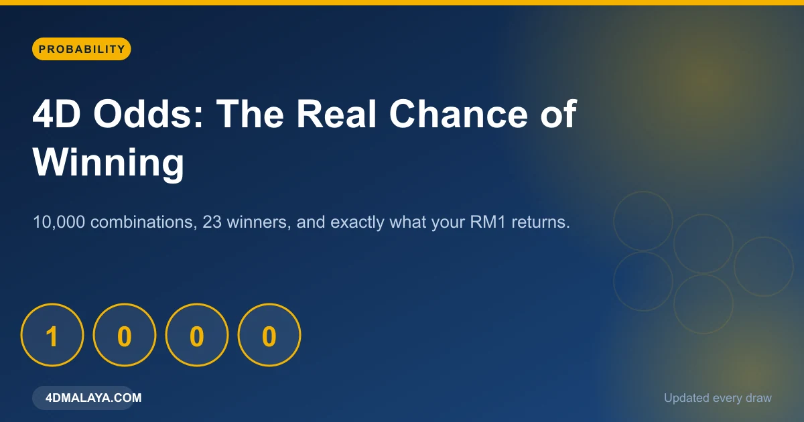
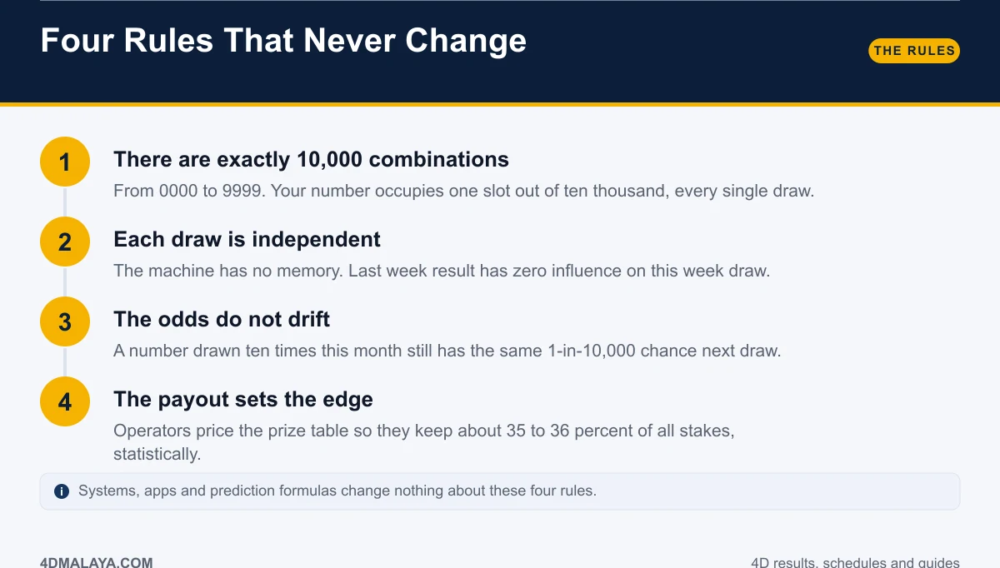
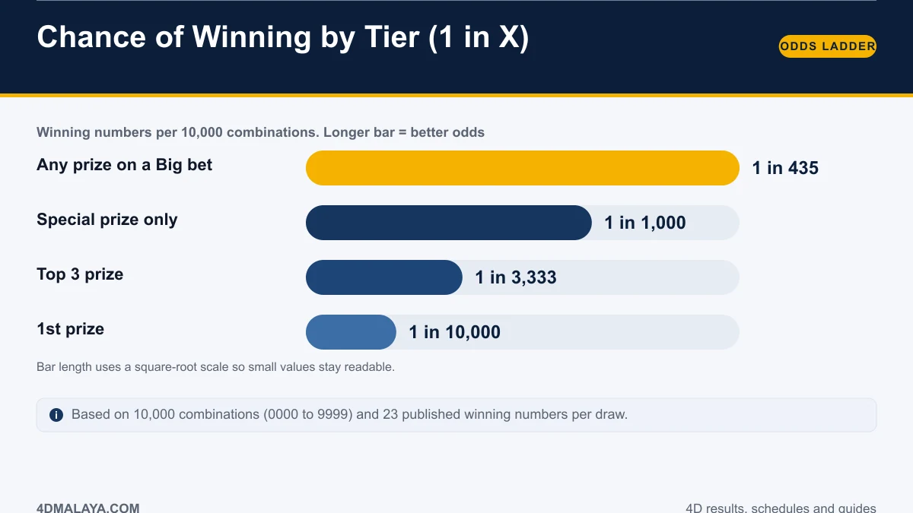
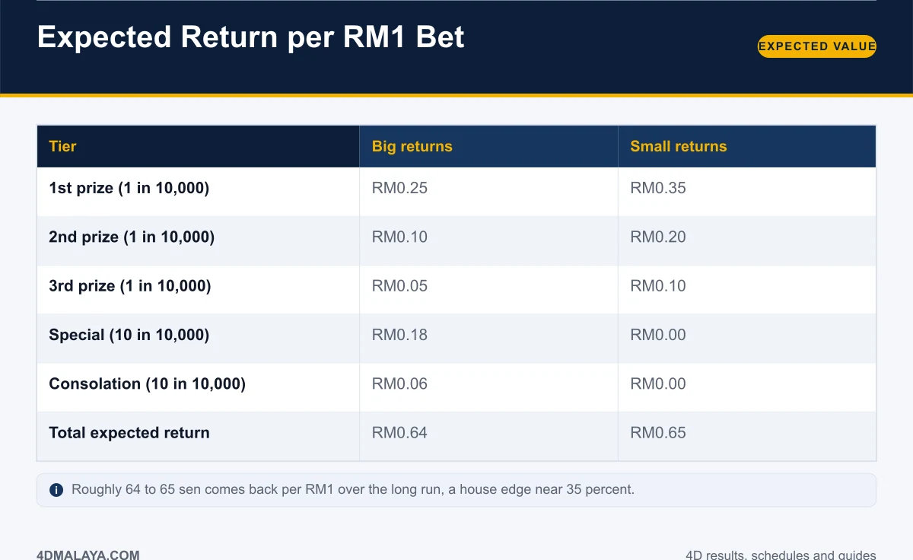
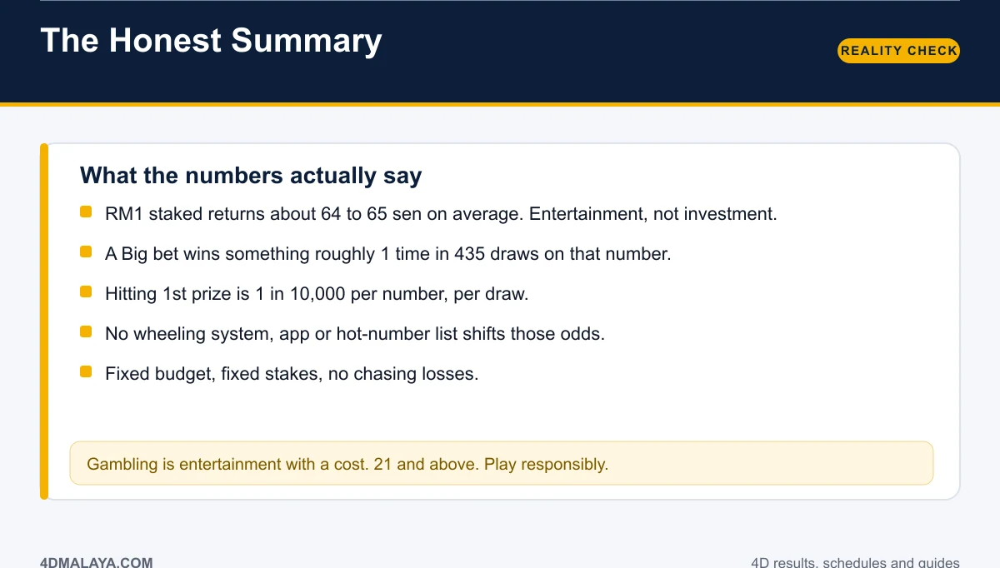

# 4D Odds Explained: The Real Probability of Winning

Strip away the lucky numbers, the dream books and the tipster groups, and a 4D game is a small, clean piece of arithmetic: **10,000 possible numbers, 23 winners per draw, one fixed payout table.** Everything you can know about your chances follows from those three facts.

This page works through the odds at each prize tier, what your ringgit is worth mathematically in the long run, and the four rules that no system, app or wheeling scheme has ever managed to break.

*Ten thousand combinations. Twenty-three winners. One honest answer.*

## The four rules that never change

1. **There are exactly 10,000 combinations.** Four digits, each 0 to 9: 0000 through 9999. Your number holds one slot out of ten thousand.
2. **Every draw is independent.** The draw has no memory of last week, last month or last year.
3. **The odds do not drift.** A number drawn ten times this month still has the same 1-in-10,000 chance next draw.
4. **The payout table sets the operator's edge.** The prize structure is priced so the operator keeps roughly 35 to 36 percent of all stakes over time.

Claim otherwise and you are being sold something.

## Odds at each prize tier

| Tier | Winning numbers | Odds |
|---|---|---|
| Any prize on a Big bet | 23 | 1 in 435 |
| Special | 10 | 1 in 1,000 |
| Top 3 prize | 3 | 1 in 3,333 |
| 1st prize | 1 | 1 in 10,000 |

Two useful readings:

- **Top three: 1 in 3,333** per number per draw. That is the number people actually mean when they say "what are my chances".
- **Any prize on a Big bet: 1 in 435.** Because the special and consolation tiers add 20 more winning numbers, a Big bet wins *something* far more often than it wins *anything big* — RM60 or RM180 payouts, not RM2,500.

That gap between "winning" and "winning big" is where most players misjudge the game.

## What your RM1 is actually worth

Expected return per RM1 staked:

| Tier | Big returns | Small returns |
|---|---|---|
| 1st prize (1 in 10,000) | RM0.25 | RM0.35 |
| 2nd prize (1 in 10,000) | RM0.10 | RM0.20 |
| 3rd prize (1 in 10,000) | RM0.05 | RM0.10 |
| Special (10 in 10,000) | RM0.18 | RM0.00 |
| Consolation (10 in 10,000) | RM0.06 | RM0.00 |
| **Total expected return** | **RM0.64** | **RM0.65** |

On average, RM1 staked returns about **64 to 65 sen** — a house edge near **35 percent**. Over a year of steady play, that difference between RM1 and RM0.64 is the honest cost of the entertainment.

None of this is a moral judgement. Theatre tickets, golf rounds and coffee habits also return nothing financial. The point is to know the price before you buy the ticket, not after.

## Why no system can beat it

Consider what a "winning system" would need to do: change the number of combinations, or change the payout table. Players control neither.

- **Hot number lists** — descriptive history, zero predictive power. See [most frequent 4D numbers](most-frequent-4d-numbers/) for what frequency data really shows.
- **Wheeling schemes** — spread your stake across combinations. They buy coverage at proportional cost; they do not shift the edge.
- **Prediction apps** — repackaged history. Same 10,000 combinations, same odds.
- **"Guaranteed" tip groups** — if someone had a genuine edge, they would not be selling it. Selling tips at a fixed price is the only guaranteed return in the business, and it goes to the seller.

The archive and its limits are set out in [4D results history](4d-results-history/); the payout table that produces these figures is in [4D prize structure](4d-prize-structure/).

## The honest summary

- **RM1 returns about 64 to 65 sen on average.**
- **1st prize is 1 in 10,000** per number, per draw.
- **A Big bet wins something about 1 in 435** — mostly small prizes.
- **No system moves any of these numbers.**
- **Fixed budget, fixed stakes, no chasing.**

Play it as entertainment with a known price, or do not play. Those are the only two sensible positions the arithmetic allows.

## FAQ

### What are the odds of winning the 4D first prize?
1 in 10,000 for any single number in a single draw, because there are 10,000 possible four-digit combinations.

### What are the odds of winning any 4D prize?
On a Big bet, about 1 in 435, since all 23 winning numbers (3 top prizes, 10 special, 10 consolation) count.

### How much does a 4D bet return in the long run?
About RM0.64 per RM1 on a Big bet and RM0.65 on a Small bet — an expected house edge of roughly 35 percent.

### Do permutations improve my odds?
No. They cover more orderings of the same digits and cost proportionally more. The chance of your number's digits appearing at all is unchanged.

### Can tracking past results improve my chances?
No. Each draw is independent. History describes what happened and cannot alter what happens next.

## The bottom line

Ten thousand combinations, twenty-three winners, RM0.64 returned per ringgit. Those three facts answer nearly every question asked about 4D. Learn them once, and every system pitch afterwards becomes easy to ignore — because the maths has already replied.

<!-- PUBLISH NOTES
Internal links:
- -> /4d-prize-structure/
- -> /4d-results-history/
- -> /most-frequent-4d-numbers/
- -> /4d-result-today/
- <- from /types-of-4d-bets/, /most-frequent-4d-numbers/, /4d-prize-structure/
Schema: Article + Table (odds/EV) + FAQPage. Breadcrumb: Home > Guides > Odds.
E-E-A-T: show the arithmetic in the body. Good candidate for a featured snippet
on "what are 4D odds".
-->
