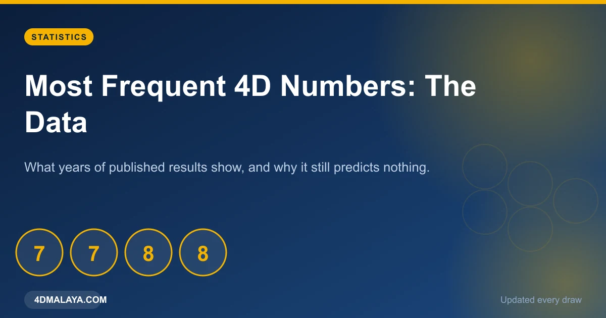
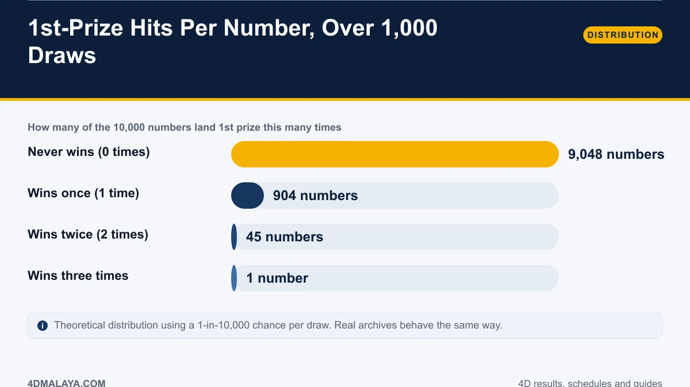
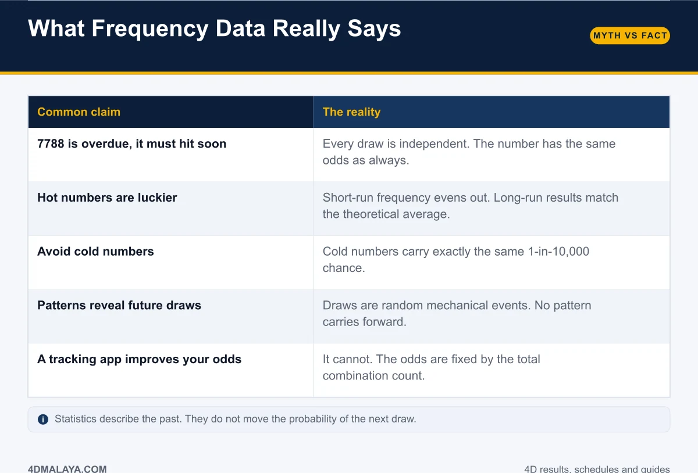
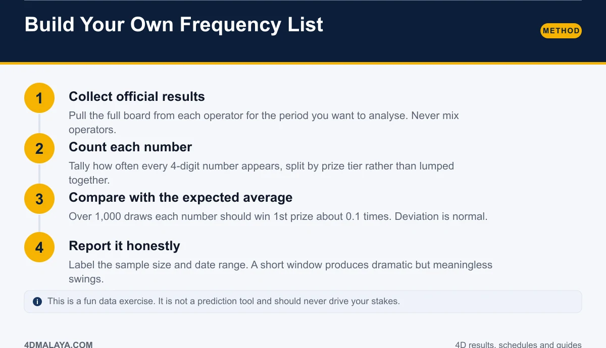
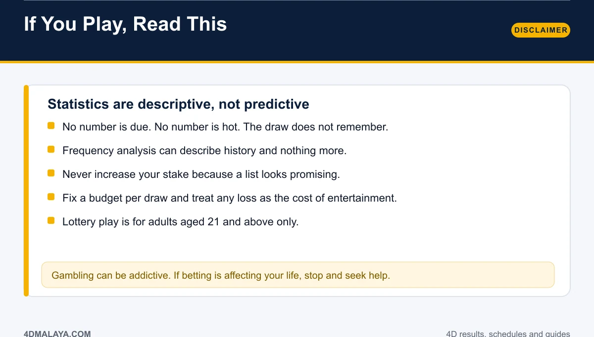

# Most Frequent 4D Numbers: What the Data Actually Shows

Every few months the same lists circulate: the "hottest" 4D numbers, the digits due to drop, the pattern spotted in last month's boards. They are shared thousands of times, and every one of them fails the same test — describing the past while pretending to predict the future.

This article does the frequency analysis properly: what the distribution of winners actually looks like over a meaningful sample, which popular claims survive contact with the maths, and how to build a frequency list honestly if you insist on building one.

*Frequency data is real. Prediction is not.*

## How often does each number actually win?

Take 1,000 draws of 1st prize results. Each draw picks one number from 10,000. Modelling that as a standard 1-in-10,000 event:

| 1st-prize hits per number | How many of the 10,000 numbers |
|---|---|
| 0 times | 9,048 numbers |
| 1 time | 904 numbers |
| 2 times | 45 numbers |
| 3 times | 1 number |

The headline is uncomfortable: **over a thousand draws, roughly 90 percent of all numbers never win 1st prize at all.** About nine percent win exactly once. Winning twice is rare; winning three times in that window is a one-in-ten-thousand curiosity.

Real archives behave the same way, because the underlying mechanism is the same way. Any "most frequent" list you see is describing which numbers landed in a small, noisy window — not which numbers are favoured.

## Myth versus reality

| Common claim | The reality |
|---|---|
| "7788 is overdue, it must hit soon" | Every draw is independent. The number has the same odds as always. |
| "Hot numbers are luckier" | Short-run frequency evens out; long-run results match the theoretical average. |
| "Avoid cold numbers" | Cold numbers carry exactly the same 1-in-10,000 chance. |
| "Patterns reveal future draws" | Draws are random events. No pattern carries forward. |
| "A tracking app improves your odds" | It cannot. Odds are fixed by the total combination count. |

The psychological hook is the same in all five rows: **the human brain treats a small sample as a trend.** Ten thousand draws is a trend. Forty draws is weather.

## Build your own frequency list — the honest way

If you want to do the analysis as a data exercise, do it correctly:

1. **Collect official results only.** Pull the full board from each operator for your chosen window. Never mix operators — you will be counting three separate games as one.
2. **Count by prize tier.** Splitting 1st-prize hits from special and consolation hits keeps the analysis meaningful. Lumping all 23 together muddles three different odds.
3. **Compare with the expected average.** Over 1,000 draws, each number should win 1st prize about 0.1 times. Deviations of a few hits are normal noise.
4. **Report the sample size and date range.** A percentage without a window is a number without a meaning.

Used that way — as description, with the window stated — frequency analysis is legitimate. The moment it starts steering your stakes, it has overreached.

## The disclaimer, in plain English

- **Statistics are descriptive, not predictive.** They summarise a window that has closed.
- **No number is due.** The draw does not remember and does not owe.
- **Never raise your stake** because a list looked promising. That is how a entertainment budget becomes a problem.
- **Fix a budget per draw** and treat every loss as the cost of the evening.
- **18 is not enough.** Gambling is restricted to adults aged 21 and above.

If tracking numbers stops being a hobby and starts being a chase, stop — support services exist and using one is not a weakness.

## FAQ

### Which 4D numbers are drawn most often?
Frequency changes across any given window and reverts toward the theoretical average over time. No number holds a durable statistical advantage.

### Do hot numbers win more in future draws?
No. Frequency describes completed draws. Each new draw starts at identical odds for all 10,000 numbers.

### Should I avoid numbers drawn recently?
There is no statistical reason to. Recent numbers carry exactly the same probability as numbers not drawn in years.

### Can a 4D frequency chart predict results?
No. A frequency chart summarises history. Prediction requires influence over the draw, which no analysis has.

### Is tracking 4D numbers harmful?
As a hobby or data exercise, no. As a staking strategy, it creates losses faster than it creates insight. Keep the two separate.

## The bottom line

Frequency analysis tells you what already happened, with a sample size attached. It cannot tell you what happens next, because nothing about a draw depends on its predecessors. Enjoy the data, state your sample honestly, and keep your stake decision out of it.

<!-- PUBLISH NOTES
Internal links:
- -> /4d-odds-probability/
- -> /4d-results-history/
- -> /4d-result-today/
- <- from /4d-odds-probability/, /4d-results-history/
Schema: Article + Table + FAQPage. Breadcrumb: Home > Guides > Statistics.
Shareable/PR angle: the "90 percent never win" chart is the linkbait asset.
Keep the disclaimer visible — regulators and ad partners both look at this page.
-->
