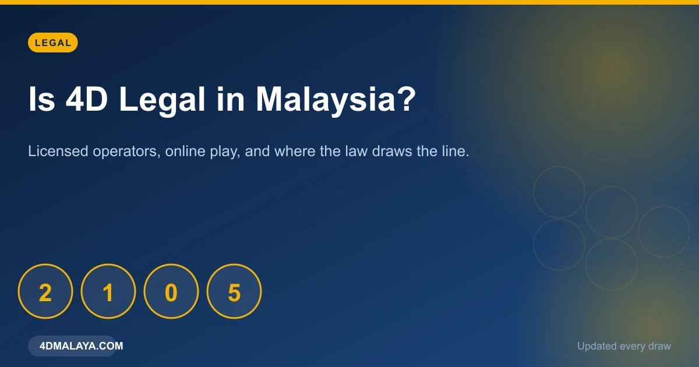
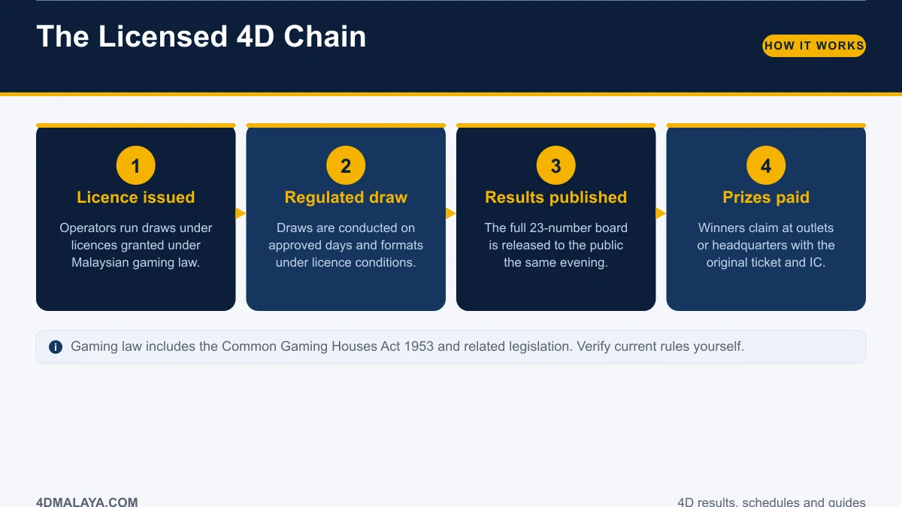
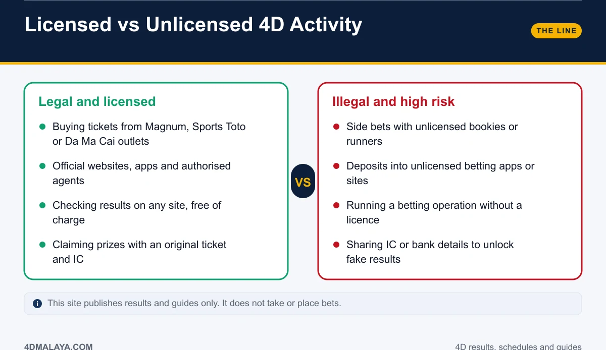
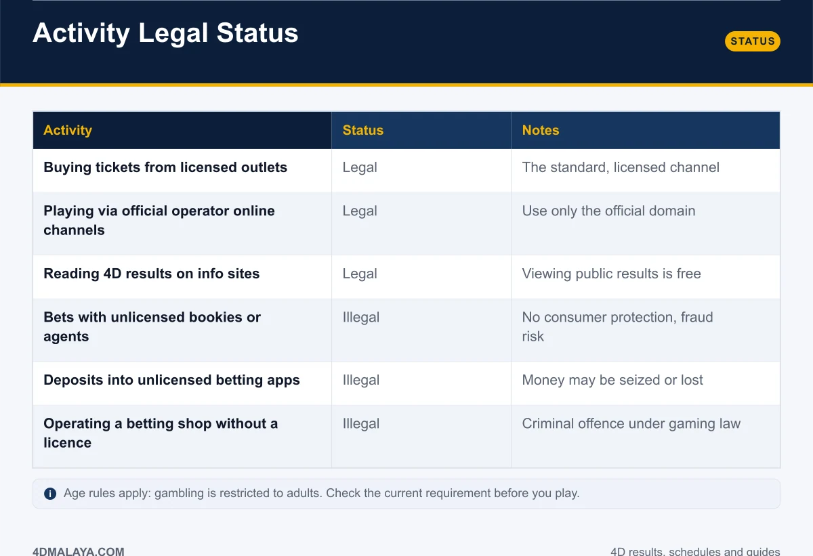
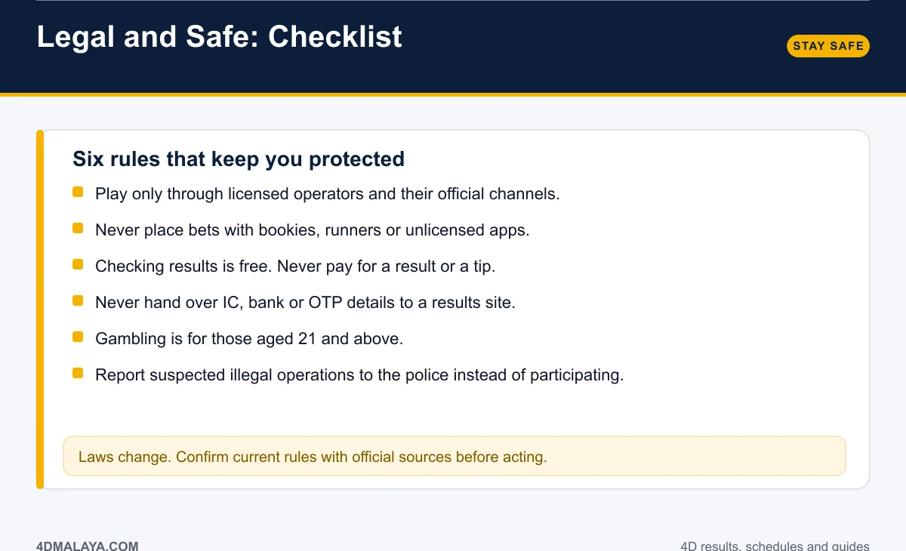

# Is 4D Legal in Malaysia? Licences, Online Play & the Law

Short answer: **4D is legal when it runs through licensed operators, and illegal when it runs through anyone else.** The line between the two is drawn by licences and by where the money goes — and it is a line people cross casually, usually through an app or a WhatsApp group, without realising it.

This guide explains how licensed 4D operates, what sits on the wrong side of the law, how online checking and online betting differ, and how to protect yourself in both.

*Licensed play, unlicensed play, and the line between them.*

## How licensed 4D works

1. **A licence is issued.** Operators run draws under licences granted under Malaysian gaming law, which includes the Common Gaming Houses Act 1953 and related legislation.
2. **The draw is regulated.** Draws follow approved formats on approved days, under the conditions of that licence.
3. **Results are published.** The full 23-number board goes to the public the same evening, free to read.
4. **Prizes are paid.** Winners claim at outlets or headquarters with the original ticket and IC.

Magnum 4D, Sports Toto and Da Ma Cai are the established licensed national pools. Checking their results, on any site, is simply reading a published record of a regulated draw — that is legal.

## Licensed versus unlicensed: where the line sits

| Activity | Status | Notes |
|---|---|---|
| Buying tickets from licensed outlets | **Legal** | The standard, licensed channel |
| Playing via official operator online channels | **Legal** | Use only the official domain |
| Reading 4D results on information sites | **Legal** | Viewing public results costs nothing |
| Betting with unlicensed bookies or runners | **Illegal** | No consumer protection, fraud risk |
| Deposits into unlicensed betting apps | **Illegal** | Money may be lost or frozen |
| Operating a betting shop without a licence | **Illegal** | Criminal offence under gaming law |

Note the last column. The risk of unlicensed play is not only legal exposure — it is that **nobody is obliged to pay you.** Unlicensed operators have no licence to revoke, no regulator to complain to, and no reason to settle a large win.

*Same list, quicker scan — keep it beside the table when you publish.*

## Online checking is not online betting

This distinction gets confused constantly, so it is worth separating:

- **Checking a result online** — reading a published draw board — is viewing public information. Free, lawful, and the entire purpose of sites like this one.
- **Placing a bet online** is only lawful through authorised operator channels. Depositing money into an unlicensed app, site or Telegram group is where people cross the line without noticing.

Unlicensed operations frequently arrive dressed as something else: a "prediction" channel, a "agent" service, a forwarded link with a bonus offer. If it takes a deposit, it had better be licensed.

## Safety checklist

1. **Play only through licensed operators** and their official outlets, sites and apps.
2. **Never bet with bookies, runners or unlicensed apps** — the legal risk and the non-payment risk are both real.
3. **Results are free.** Never pay for a result, a tip or an "early number".
4. **Never hand over IC, bank or OTP details** to a results site. No legitimate board needs them.
5. **Gambling is for 21 and above.** Age rules apply regardless of channel.
6. **Report suspected illegal operations** to the police rather than participating in them.

If you are unsure whether an operator is licensed, start from the operator's own official site and work inward — not from a link someone sent you.

## How this site fits in

4DMalaya publishes results, schedules, statistics and guides. **It does not take bets, hold stakes, or link to unlicensed bookmakers.** Reading a result board here is the same act as reading one in a newspaper: public information about a regulated draw.

The companion guides cover the practical side: [how to check 4D results online](how-to-check-4d-result-online/), the [4D draw schedule](4d-draw-schedule/), and [4D prize structure](4d-prize-structure/).

## FAQ

### Is 4D betting legal in Malaysia?
Bets placed through licensed operators and their authorised channels are legal. Betting through unlicensed bookies, agents or apps is not.

### Is it legal to check 4D results online?
Yes. Draw results are public information. Reading them on any site costs nothing and carries no legal issue.

### Are online 4D bets legal?
Only through authorised operator channels. Deposits into unlicensed sites or apps are illegal and unprotected.

### Is it illegal to bet with a friend?
Private social wagering is a different question from running an unlicensed operation. Taking bets from others as a business without a licence is where serious exposure begins. Take legal advice on anything beyond personal play.

### What should I do if I suspect an illegal operation?
Do not participate. Report it to the police instead of depositing money and hoping for the best.

### How old do you have to be to buy 4D?
Gambling is restricted to adults — 21 and above for licensed lottery and gaming activity in Malaysia. Confirm current requirements with the operator.

## The bottom line

Licensed operators: legal, regulated, obliged to pay. Unlicensed apps, agents and bookies: illegal, unprotected, and the most common way people lose money they cannot recover. Checking results anywhere is fine. Placing a bet is where the licence matters — and a licence is not something a website can talk you into believing it has.

<!-- PUBLISH NOTES
Internal links:
- -> /how-to-check-4d-result-online/
- -> /4d-winnings-tax-malaysia/
- -> /4d-result-today/
- <- from /how-to-check-4d-result-online/, /4d-winnings-tax-malaysia/
Schema: Article + Table + FAQPage. Breadcrumb: Home > Guides > Legal.
YMYL page: cite official/statute sources in the live version where possible.
This page also protects ad eligibility — keep the "results only, no betting" framing.
-->
